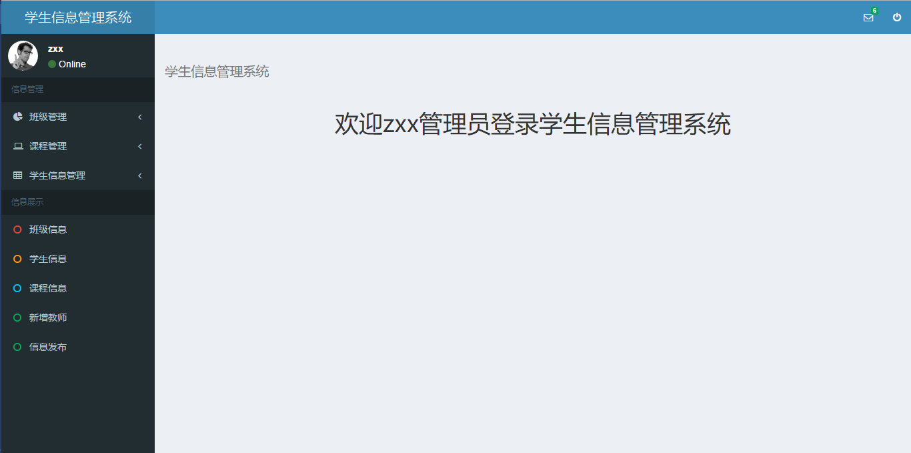

# StudentInfo 学生信息管理系统
> 学生信息管理系统，SpringMVC+Hibernate+Spring+SqlServer

学生信息管理，共有三种角色，管理员，教师，学生，提供角色权限控制



## 安装

直接pull项目到IDE中，从项目WebRoot/resource下执行sql脚本创建sqlserver数据库

配置WEB-INF/lib文件到运行环境，修改applicationContext.xml中的sqlserver数据库账户和密码
## 使用

使用admin账户admin密码登陆系统，请自行添加老师和学生，
学生支持批量导入，模板在WebRoot/excelTemplate下。

## 功能介绍
```
提供消息展示，权限控制，登陆验证等
代码最大化代码复用
```
> ### 管理员

- 班级管理：

> 1. 查找班级	按班级姓名模糊查询，修改班级异步刷新。
> 2. 添加班级
> 3. 添加年级

- 课程管理：

> 1. 查找课程信息	按课程姓名模糊查询，修改课程异步刷新。
> 2. 添加课程信息

- 学生信息管理：

> 1. 查找学生信息	按学生姓名模糊查询，修改学生信息异步刷新。
> 2. 查找班级学生信息
> 3. 添加学生信息

- 信息展示：

> 1. 班级信息	分页Datatable显示
> 2. 学生信息	分页Datatable显示
> 3. 课程信息	分页Datatable显示
> 4. 新增教师	
> 5. 信息发布	

> ### 教师

- 班级管理：

> 1. 查找班级	按班级姓名模糊查询，修改班级异步刷新。

- 课程管理：

> 1. 查找课程信息	按课程姓名模糊查询，修改课程异步刷新。
> 2. 查看学生成绩	学生成绩DataTable分页显示

- 学生信息管理：

> 1. 查找学生信息	按学生姓名模糊查询，修改学生信息异步刷新。
> 2. 学生成绩管理	查找具体班级下的学生成绩，并异步修改刷新

- 信息展示：

> 1. 班级信息	分页Datatable显示
> 2. 学生信息	分页Datatable显示
> 3. 课程信息	分页Datatable显示

> ### 学生

- 班级查看：

> 1. 查看班级	

- 课程查看：

> 1. 查找课程信息	
> 2. 查看班级课程

- 个人信息管理：

> 1. 查找个人信息	
> 2. 修改个人信息	
> 3. 修改密码	

## 个人信息

Zeral – [@YourTwitter](https://twitter.com/Sg2UpQxf7pQvy9c) – zeralzhang@gmail.com

[https://github.com/zeral-zhang](https://github.com/zeral-zhang/)

